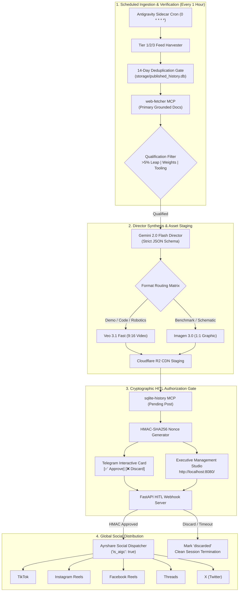

# AI Tech Broadcaster

> **Autonomous Executive Producer & Short-Form Broadcast Engine for Frontier AI Intelligence**  
> *Target Runtime: Google Antigravity 2.0 (Scheduled Sidecar & MCP Architecture)*  
> *Target Models: Gemini 2.0 Flash (Director) | Google Veo 3.1 Fast (Video) | Google Imagen 3.0 (Graphics)*

---

## 🌟 Overview

**AI Tech Broadcaster** is an autonomous, production-grade intelligence broadcast engine designed to run natively within **Google Antigravity 2.0**. Operating on an automated 1-hour scheduled sidecar cycle (`0 * * * *`), the system:

1. **Monitors & Harvests** breakthrough technical releases across primary AI laboratories (DeepMind, OpenAI, Anthropic, Meta AI), ArXiv research preprints (`cs.AI`, `cs.CL`, `cs.CV`), and GitHub trending repositories.
2. **Deduplicates Deterministically** via local SQLite history (`storage/published_history.db`) using a strict 14-day sliding lookback window.
3. **Verifies Technical Grounding** by extracting raw documentation via Model Context Protocol (`web-fetcher/fetch`) to enforce a **zero-hallucination guarantee** on benchmark metrics, context windows, and parameters.
4. **Synthesizes & Directs Media** via **Gemini 2.0 Flash**, routing dynamic demos and code execution into **Google Veo 3.1 Fast** 9:16 vertical video clips (paired with TTS narration) and technical benchmarks into **Google Imagen 3.0** 1:1 isometric schematics.
5. **Stages Assets to CDN** via S3-compatible **Cloudflare R2** object storage.
6. **Enforces Cryptographic Human-in-the-Loop (HITL) Gate** by dispatching interactive preview cards with HMAC-SHA256 nonces to a private **Telegram channel** and local **Web Management Studio**.
7. **Broadcasts Globally** upon verified editorial approval across **TikTok, Instagram Reels, Facebook Reels, Threads, and X** via Ayrshare with mandatory `"is_aigc": true` synthetic media disclosure.

---

## 🏗️ System Architecture



---

## 💎 Constitutional Invariants & Rules

- **Zero Hallucination**: No rumors, financial speculation, or unverified secondary social media claims. Every benchmark metric, latency stat, and context window figure must be explicitly verified in the primary announcement text.
- **Deterministic Deduplication**: Never process a story or subject covered within the last 14 days in `storage/published_history.db`.
- **HITL Authorization Lock**: Under no circumstances can media or copy be pushed directly to public social networks without explicit cryptographic authorization from Telegram or the Executive Studio.

---

## ⚡ Quickstart & 1-Click Launch

### Prerequisites
- Python 3.11+
- `uv` (recommended) or `pip`
- SQLite 3.35+

### Installation
```bash
# Clone the repository
git clone https://github.com/Bashar-ml-en/AI-Tech-Broadcaster.git
cd AI-Tech-Broadcaster

# Create virtual environment and install dependencies
uv venv .venv
uv pip install -r requirements.txt --python .venv/Scripts/python.exe
```

### Configuration
```bash
# Copy template and add your credentials
cp config/.env.example config/.env
```

### 1-Click Studio Launch (Windows)
Double-click **`start_studio.bat`** or run:
```powershell
.venv\Scripts\python.exe manage.py studio --port 8080
```
This launches the local server and automatically opens your browser at **`http://localhost:8080/`**.

---

## 🎛️ Executive Management Studio (`http://localhost:8080/`)

The built-in web studio provides real-time command-and-control over the broadcaster:

- **⚡ Scan & Direct Now**: Trigger an immediate live harvesting and synthesis cycle with one click.
- **⏱ Hourly Sidecar Toggle**: Start or stop the autonomous background 1-hour daemon.
- **📱 Reels & Story Studio**:
  - Live 9:16 vertical video player and 1:1 graphic viewer for staged assets.
  - 4-Block narration script breakdown (Disruption Hook, Core Event, Practical Application, Debate CTA).
  - One-click copy for platform-specific captions with hashtags.
  - Instant **`[✅ Approve & Publish Globally]`** and **`[❌ Discard Story]`** decision buttons.
- **📊 Real-Time Metrics & Logs**: Live KPIs and streaming activity logs.

---

## 🛠️ Model Context Protocol (MCP) Tools

The agent interacts through standard Stdio JSON-RPC 2.0 MCP servers defined in [`.agents/mcp_config.json`](.agents/mcp_config.json):

| Server | Tool | Description |
| :--- | :--- | :--- |
| `sqlite-history` | `read_query` | Query history database for 14-day deduplication checks. |
| `sqlite-history` | `write_query` | Insert pending posts and update status (`approved`, `published`, `discarded`). |
| `web-fetcher` | `fetch` | Retrieve raw HTML/text from primary documentation for grounded extraction. |
| `social-dispatcher` | `upload_media_to_r2` | Upload rendered video/graphic to Cloudflare R2 and return CDN URL. |
| `social-dispatcher` | `send_telegram_approval` | Dispatch interactive approval card with cryptographic HMAC token. |
| `social-dispatcher` | `publish_to_networks` | Publish approved asset to TikTok, Instagram, Facebook, Threads, X via Ayrshare. |

Run diagnostic tests on all MCP tools:
```powershell
.venv\Scripts\python.exe src/mcp_social_server.py --test
```

---

## 🎬 Narrative Retention & Generative Guidelines

### The 4-Block Narration Formula (30–45s Pacing)
1. **Block 1: Disruption Hook (0–3s)**: Stop feed scrolling immediately with a high-contrast factual assertion. Zero greetings or channel throat-clearing.
2. **Block 2: The Core Event (4–18s)**: State the primary technical development, the lab behind it, and the definitive metric that matters.
3. **Block 3: Practical Application (19–30s)**: Explain what software engineers or users can build today that was impossible yesterday.
4. **Block 4: The Debate CTA (Final 5s)**: Ask a pointed technical question designed to trigger discussion in the comments.

### Generative Media Directives
- **Google Veo 3.1 Fast (`format = "video"`)**: Enforce `9:16 vertical aspect ratio`, cinematic volumetric lighting, dynamic tracking camera motion, photorealistic rendering, and **strictly zero baked-in typography**.
- **Google Imagen 3.0 (`format = "text_image"`)**: Enforce `1:1 square aspect ratio`, clean vector/isometric schematic aesthetic, high contrast, and dark-mode color balance.

---

## 📁 Repository Structure

```
AI-Tech-Broadcaster/
├── .agents/
│   ├── agents/
│   │   └── social-broadcaster.md   # Antigravity 2.0 Master Agent Directive
│   ├── skills/
│   │   ├── media-director/
│   │   │   └── SKILL.md            # Retention Engineering & Media Direction Skill
│   │   └── news-scraper/
│   │       └── SKILL.md            # Harvesting, Deduplication & Qualification Skill
│   └── mcp_config.json             # MCP Server Registrations
├── config/
│   ├── .env.example                # Environment variables template
│   └── .env                        # Active environment secrets (git-ignored)
├── src/
│   ├── mcp_social_server.py        # Stdio JSON-RPC 2.0 MCP Server (Tools)
│   ├── pipeline.py                 # Autonomous Harvesting, Directing & Sidecar Engine
│   ├── r2_storage.py               # Cloudflare R2 S3-Compatible CDN Staging
│   └── webhook_server.py           # FastAPI HITL Webhook & Executive Management Studio
├── storage/
│   ├── logs/                       # Autonomous broadcast activity logs
│   ├── staging/                    # Local renders (Veo 3.1 MP4s, Imagen 3.0 PNGs)
│   └── published_history.db        # SQLite Deduplication & History Database
├── DEPLOYMENT_AND_EXECUTION.md     # Comprehensive deployment & runbook guide
├── MCP_ARCHITECTURE_AND_SERVERS.md # Full MCP specifications and schemas
├── PROMPTS_AND_SCHEMAS.md          # Strict JSON schemas & prompt catalog
├── SYSTEM_ARCHITECTURE.md          # Master architecture and security blueprints
├── manage.py                       # Unified management CLI
├── start_studio.bat                # 1-Click Windows Studio launcher
├── run_scan.bat                    # 1-Click manual scan trigger
├── requirements.txt                # Production Python dependencies
├── .gitignore                      # Git ignore rules
└── README.md                       # Project documentation
```

---

## ⚖️ License & Ethical AI Transparency

This software is designed for autonomous technical broadcasting. All content generated and dispatched through this system includes mandatory `"is_aigc": true` metadata flags, adhering to international synthetic media disclosure standards and social platform policies.
