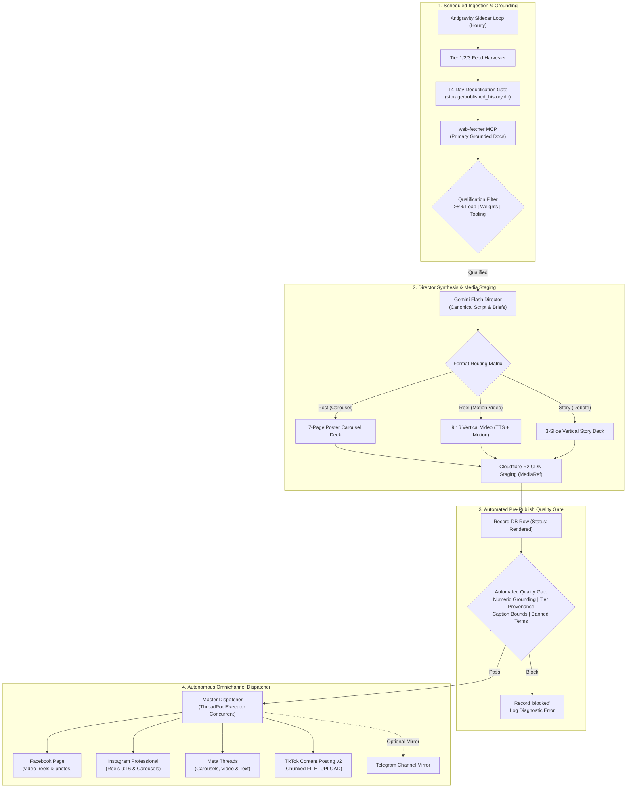

# AI Tech Broadcaster

> **Autonomous Executive Producer & Omnichannel Broadcast Engine for Frontier AI Intelligence**  
> *Target Runtime: Google Antigravity 2.0 (Scheduled Sidecar & MCP Architecture)*  
> *Target Publishing: Facebook Pages, Instagram Professional, Meta Threads, TikTok Content Posting API v2*  
> *Target Models: Gemini 2.0 Flash / 2.5 Flash (Director & Quality Gate) | Apple Fluid Motion & Video Synthesizer*

---

## 🌟 Overview

**AI Tech Broadcaster** is an autonomous, production-grade intelligence broadcast engine designed to run natively within **Google Antigravity 2.0**. Operating on an automated scheduled sidecar cycle (`SCHEDULE_INTERVAL_HOURS`, default hourly), the system:

1. **Monitors & Harvests** breakthrough technical releases across primary AI laboratories (DeepMind, OpenAI, Anthropic, Meta AI), ArXiv research preprints (`cs.AI`, `cs.CL`, `cs.CV`), and GitHub trending repositories.
2. **Deduplicates Deterministically** via local SQLite history (`storage/published_history.db`) using a strict 14-day sliding lookback window.
3. **Verifies Technical Grounding** by extracting raw documentation via Model Context Protocol (`web-fetcher/fetch`) to enforce a **zero-hallucination guarantee** on benchmark metrics, context windows, and parameters.
4. **Synthesizes & Directs Media** via **Gemini 2.0 Flash**, routing dynamic demos and code execution into 9:16 vertical video reels (paired with TTS narration) and technical benchmarks into 7-page poster carousels and 3-slide vertical story decks.
5. **Stages Assets to Public CDN** via S3-compatible **Cloudflare R2** object storage with MediaRef validation.
6. **Enforces Automated Pre-Publish Quality Gate**: Evaluates numeric grounding against primary source text, feed source allowlists, platform caption bounds, media constraints, banned financial/rumor terms, and content hash duplication before anything is sent.
7. **Broadcasts Omnichannel Autonomously** to **Facebook Pages, Instagram Professional, Meta Threads, and TikTok** via native HTTPS APIs with mandatory `is_aigc: true` synthetic media disclosure and complete error isolation.

---

## 🏗️ System Architecture


```mermaid
flowchart TD
    subgraph S1["1. Scheduled Ingestion & Grounding"]
        Cron["Antigravity Sidecar Loop (Hourly)"] --> Harvest["Tier 1/2/3 Feed Harvester"]
        Harvest --> Dedup["14-Day Deduplication Gate<br/>(storage/published_history.db)"]
        Dedup --> Fetcher["web-fetcher MCP<br/>(Primary Grounded Docs)"]
        Fetcher --> Qualify{"Qualification Filter<br/>>5% Leap | Weights | Tooling"}
    end

    subgraph S2["2. Director Synthesis & Media Staging"]
        Qualify -- Qualified --> Director["Gemini Flash Director<br/>(Canonical Script & Briefs)"]
        Director --> Routing{"Format Routing Matrix"}
        Routing -- "Post (Carousel)" --> Deck["7-Page Poster Carousel Deck"]
        Routing -- "Reel (Motion Video)" --> Vid["9:16 Vertical Video (TTS + Motion)"]
        Routing -- "Story (Debate)" --> StoryDeck["3-Slide Vertical Story Deck"]
        Deck --> Stager["Cloudflare R2 CDN Staging (MediaRef)"]
        Vid --> Stager
        StoryDeck --> Stager
    end

    subgraph S3["3. Automated Pre-Publish Quality Gate"]
        Stager --> DBLog["Record DB Row (Status: Rendered)"]
        DBLog --> Gate{"Automated Quality Gate<br/>Numeric Grounding | Tier Provenance<br/>Caption Bounds | Banned Terms"}
        Gate -- "Block" --> Block["Record 'blocked'<br/>Log Diagnostic Error"]
    end

    subgraph S4["4. Autonomous Omnichannel Dispatcher"]
        Gate -- "Pass" --> Dispatcher["Master Dispatcher<br/>(ThreadPoolExecutor Concurrent)"]
        Dispatcher --> FB["Facebook Page<br/>(video_reels & photos)"]
        Dispatcher --> IG["Instagram Professional<br/>(Reels 9:16 & Carousels)"]
        Dispatcher --> TH["Meta Threads<br/>(Carousels, Video & Text)"]
        Dispatcher --> TT["TikTok Content Posting v2<br/>(Chunked FILE_UPLOAD)"]
        Dispatcher -. Optional Mirror .-> TG["Telegram Channel Mirror"]
    end
```

---

## ⚙️ Publishing Modes

Configure `PUBLISH_MODE` in `config/.env`:

| Mode | Behavior | Use Case |
| :--- | :--- | :--- |
| **`simulate`** | Safe default. Never makes live API calls to social platforms. Generates realistic request previews with tokens redacted. | Local development, dry-run testing, CI/CD verification. |
| **`auto`** | Calls live APIs for platforms with valid credentials; gracefully simulates platforms whose credentials are missing. | Incremental onboarding as platform tokens are configured. |
| **`live`** | Requires valid tokens for all enabled platforms. Missing credentials or unhosted assets produce explicit errors (`NOT_CONFIGURED`). | Full unattended production deployment. |

---

## 🔑 Platform Credentials & Scopes Reference

All credentials live in `config/.env` (gitignored, never committed):

| Environment Variable | Platform / Service | Required Permissions / Scopes | Token Lifetime & Refresh | Where to Obtain |
| :--- | :--- | :--- | :--- | :--- |
| `META_PAGE_ID` | Facebook / Meta | Page Admin ID | Permanent | [Meta Business Suite](https://business.facebook.com/) |
| `META_PAGE_ACCESS_TOKEN` | Facebook & Instagram | `pages_manage_posts`, `pages_read_engagement`, `instagram_basic`, `instagram_content_publish` | Never expires (Page Access Token exchanged from System User) | [Meta for Developers Graph Explorer](https://developers.facebook.com/tools/explorer/) |
| `META_INSTAGRAM_ACCOUNT_ID` | Instagram | Linked Professional Account ID | Permanent | Discovered automatically via `/{page_id}` |
| `THREADS_USER_ID` | Threads | Threads Account User ID | Permanent | Threads App settings or `GET /me` |
| `THREADS_ACCESS_TOKEN` | Threads | `threads_basic`, `threads_content_publish` | 60 days (Auto-refreshed via `th_refresh_token` grant) | [Meta Threads API Developer Portal](https://developers.facebook.com/docs/threads/) |
| `TIKTOK_CLIENT_KEY` | TikTok Content Posting | App Client Key | Permanent | [TikTok for Developers](https://developers.tiktok.com/) |
| `TIKTOK_CLIENT_SECRET` | TikTok Content Posting | App Client Secret | Permanent | TikTok Developer Portal |
| `TIKTOK_ACCESS_TOKEN` | TikTok Content Posting | `video.publish`, `video.upload` | 24 hours (Auto-refreshed via `refresh_token` grant) | TikTok OAuth v2 Flow |
| `TIKTOK_REFRESH_TOKEN` | TikTok Content Posting | `video.publish`, `video.upload` | 365 days (Auto-managed in `storage/tiktok_token.json`) | TikTok OAuth v2 Flow |
| `CLOUDFLARE_R2_ACCOUNT_ID` | Cloudflare R2 | S3 Read/Write | Permanent | [Cloudflare Dashboard](https://dash.cloudflare.com/) > R2 |
| `CLOUDFLARE_R2_PUBLIC_URL` | Cloudflare R2 | Public HTTPS bucket binding | Permanent | Cloudflare R2 Custom Domain or `r2.dev` |
| `GEMINI_API_KEY` | Google Gemini | GenAI API access | Permanent API Key | [Google AI Studio](https://aistudio.google.com/) |

---

## 💎 Constitutional Invariants & Rules

- **Zero Hallucination**: No rumors, financial speculation, or unverified secondary claims. Every benchmark metric, latency stat, and context window figure must be explicitly verified in the primary announcement text.
- **Deterministic Deduplication**: Never process a story covered within the last 14 days in `storage/published_history.db`.
- **Automated Quality Gate Lock**: Nothing publishes unless the quality gate returns an explicit `pass`. Blocks ungrounded numbers, unauthorized feed tiers, platform caption overflows, banned stock tickers (`$NVDA`), and duplicate content hashes.
- **Zero Stock Image Fallbacks**: Never substitutes Unsplash or random stock photography. If media cannot be hosted, live publishing fails safe.

---

## ⚡ Quickstart & CLI Management

### Prerequisites
- Python 3.11+
- `uv` (recommended) or `pip`
- macOS or Linux

### Installation & Doctor
```bash
# Clone the repository
git clone https://github.com/Bashar-ml-en/AI-Tech-Broadcaster.git
cd AI-Tech-Broadcaster

# Install dependencies using uv
uv venv .venv
uv pip install -r requirements.txt

# Run comprehensive system diagnostics
uv run python manage.py doctor
```

### CLI Commands
```bash
# 1. Check system status and database KPIs
uv run python manage.py status

# 2. Trigger an immediate autonomous broadcast scan
uv run python manage.py scan --format all      # Full multi-variant diversified cycle
uv run python manage.py scan --format reel     # 9:16 vertical motion video only
uv run python manage.py scan --format post     # 7-page carousel deck only
uv run python manage.py scan --format story    # 3-slide ephemeral story deck only

# 3. Launch Web Management Studio
uv run python manage.py studio --port 8080

# 4. Run background sidecar daemon loop
uv run python manage.py sidecar
```

---

## 🛠️ Model Context Protocol (MCP) Tools

The agent interacts through standard Stdio JSON-RPC 2.0 MCP servers defined in [`.agents/mcp_config.json`](.agents/mcp_config.json):

| Server | Tool | Description |
| :--- | :--- | :--- |
| `sqlite-history` | `read_query` | Query history database for deduplication and audit checks. |
| `sqlite-history` | `write_query` | Insert and update broadcast post records. |
| `web-fetcher` | `fetch` | Retrieve raw HTML/text from primary documentation for grounded extraction. |
| `social-dispatcher` | `upload_media_to_r2` | Upload rendered video/graphic to Cloudflare R2 with MediaRef validation. |
| `social-dispatcher` | `publish_to_networks` | Autonomous omnichannel broadcast across Facebook, Instagram, Threads, and TikTok. |
| `social-dispatcher` | `get_publish_status` | Query publication outcome, remote IDs, permalinks, and platform logs for a post. |

Run diagnostic tests on all MCP tools:
```bash
uv run python src/mcp_social_server.py --test
```

---

## 📁 Repository Structure

```
AI-Tech-Broadcaster/
├── .agents/
│   ├── agents/
│   │   └── social-broadcaster.md   # Antigravity 2.0 Master Agent Directive
│   ├── skills/
│   │   ├── media-director/         # Retention Engineering & Script Routing Skill
│   │   └── news-scraper/           # Harvesting, Deduplication & Qualification Skill
│   └── mcp_config.json             # MCP Server Registrations
├── config/
│   ├── .env.example                # Environment variables template
│   └── .env                        # Active environment configuration (git-ignored)
├── src/
│   ├── publish_types.py            # Typed contracts (PlatformResult, DispatchResult, MediaRef)
│   ├── publisher_autonomous.py     # Master omnichannel dispatcher (Facebook, IG, Threads, TikTok)
│   ├── publisher_meta.py           # Native Meta Graph API publisher (FB Pages & IG Pro)
│   ├── publisher_threads.py        # Native Threads API publisher (Carousels, Video & Text)
│   ├── publisher_tiktok.py         # Native TikTok Content Posting API v2 publisher
│   ├── quality_gate.py             # Pre-publish factual and compliance quality gate
│   ├── pipeline.py                 # 5-stage autonomous broadcast lifecycle engine
│   ├── r2_storage.py               # Cloudflare R2 media staging & container validator
│   ├── webhook_server.py           # Management Studio & SQLite schema
│   └── mcp_social_server.py        # Stdio JSON-RPC 2.0 MCP Server
├── storage/
│   ├── published_history.db        # SQLite Deduplication & Publication History Database
│   ├── staging/                    # Local renders and temporary assets
│   ├── .cycle.lock                 # Concurrency protection lockfile
│   └── logs/                       # Autonomous broadcast activity logs
├── manage.py                       # Unified management & diagnostic CLI
├── requirements.txt                # Production Python dependencies
└── README.md                       # Master documentation
```

---

## ⚖️ License & Ethical AI Transparency

This software is designed for autonomous technical broadcasting. All content generated and dispatched through this system includes mandatory `"is_aigc": true` metadata flags, adhering to international synthetic media disclosure standards and social platform policies.
