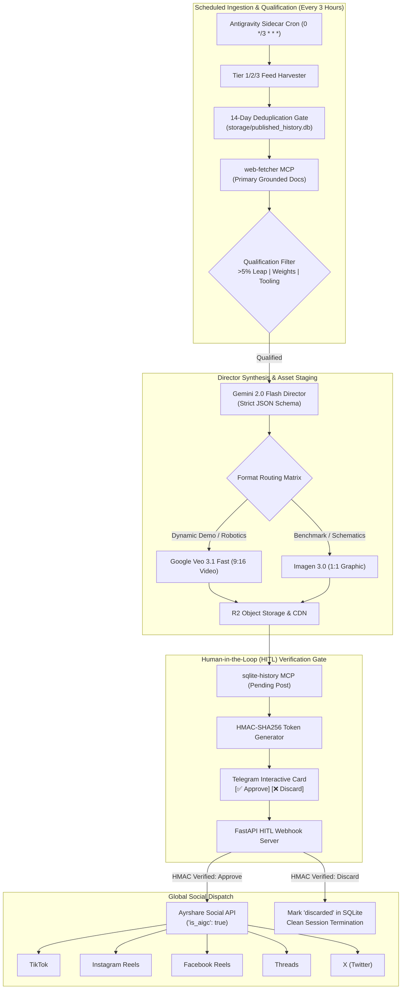
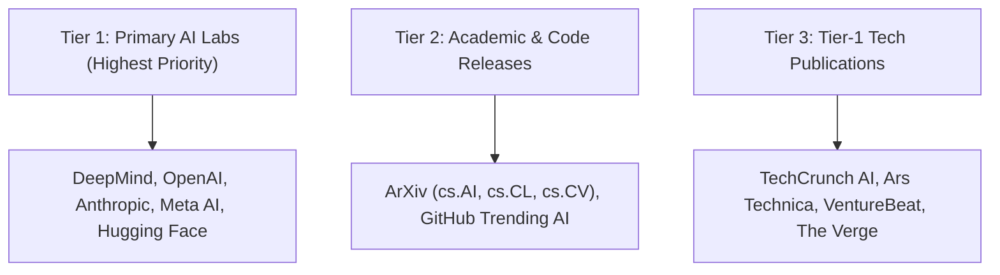
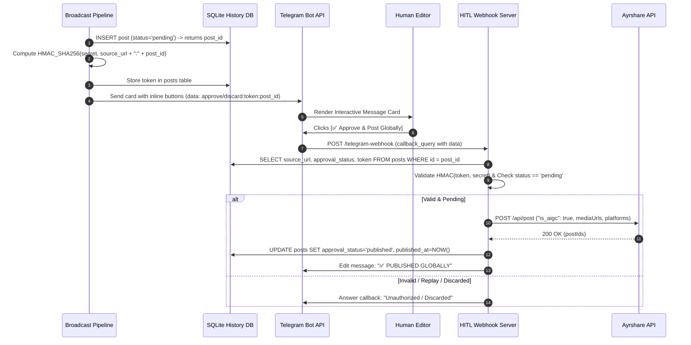
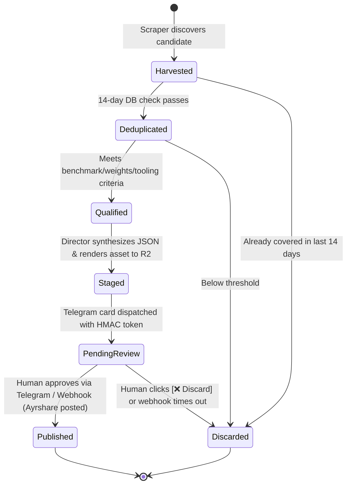

# System Architecture: Autonomous AI Tech Broadcaster
**Target Runtime:** Google Antigravity 2.0 (Scheduled Sidecar & MCP Architecture)  
**Target Models:** Gemini 2.0 Flash (Director) | Google Veo 3.1 Fast / Imagen 3.0 (Media Generation)

---

## 1. Executive Summary & Architectural Overview

The **Autonomous AI Tech Broadcaster** is an enterprise-grade agentic broadcasting engine operating natively within Google Antigravity 2.0. Every 3 hours, a scheduled sidecar awakens the Director agent, which monitors primary technical research from tier-1 AI laboratories, academics, and code repositories. Qualified breakthroughs are verified against primary documentation, synthesized into high-retention short-form media directives, staged to Cloudflare R2, and held behind a cryptographically secured Human-in-the-Loop (HITL) Telegram authorization gate before global distribution across TikTok, Instagram Reels, Facebook Reels, Threads, and X via Ayrshare.



---

## 2. Core Architectural Pillars

### Pillar 1: Constitutional Invariants & Zero Hallucination
- **Grounded Verification**: All claims, context window sizes, parameter counts, and benchmark percentages must be extracted directly from official primary announcements (DeepMind, OpenAI, Anthropic, Meta AI, ArXiv preprints). Secondary social rumors and financial speculation are strictly blocked.
- **Deterministic Deduplication**: A 14-day lookback window in `storage/published_history.db` guarantees that duplicate URLs or overlapping technical subjects are discarded prior to script generation.
- **HITL Authorization Lock**: Under no circumstances can assets be published without explicit cryptographic approval through Telegram callback queries.

### Pillar 2: Information Harvesting & Selection Hierarchy



A story is qualified if and only if it passes at least one qualification threshold:
1. **Quantifiable Capability Leap**: Statistically significant benchmark advancement (>5% gain on SWE-bench, MMLU, GSM8K, etc.).
2. **Public Weight / Endpoint Availability**: Open-weights release (Hugging Face / GitHub) or immediate API general availability.
3. **Breakthrough Developer Tooling**: A production-ready framework, compiler, or runtime that resolves active software engineering bottlenecks.

### Pillar 3: Format Routing & Retention Engineering
The Director routes stories into two production pipelines based on content type:
- **`format = "video"`**: Dynamic software demonstrations, robotics, code execution screencasts, or multimodal model capabilities. Rendered as 9:16 vertical MP4 (6s) via Google Veo 3.1 Fast with TTS narration.
- **`format = "text_image"`**: Benchmark comparison matrices, system architecture schematics, safety/policy papers, or API pricing updates. Rendered as 1:1 square graphic via Imagen 3.0.

Narration pacing strictly follows the **4-Block Pacing Model (30–45s total)**:
- **Block 1 (0–3s)**: Disruption Hook (zero greetings, bold high-contrast claim).
- **Block 2 (4–18s)**: Core Event (release, team, primary metric).
- **Block 3 (19–30s)**: Practical Application (what developers can build today).
- **Block 4 (Final 5s)**: Debate Call to Action (polarizing technical question).

---

## 3. Cryptographic Security Model (Telegram HITL Gate)

To prevent spoofed approvals, accidental callbacks, or replay attacks, the HITL approval gate employs a tamper-proof HMAC-SHA256 signature scheme:



---

## 4. State Transition Machine



---

## 5. Storage & Database Schema (`storage/published_history.db`)

The SQLite database acts as the single source of truth for deduplication and audit logging:

```sql
CREATE TABLE IF NOT EXISTS posts (
    id INTEGER PRIMARY KEY AUTOINCREMENT,
    source_url TEXT UNIQUE NOT NULL,
    headline TEXT NOT NULL,
    format_type TEXT NOT NULL,             -- 'video' | 'text_image'
    media_url TEXT,                         -- Cloudflare R2 Public CDN URL
    approval_status TEXT NOT NULL DEFAULT 'pending', -- 'pending' | 'approved' | 'discarded' | 'published'
    hook_narration TEXT,
    body_narration TEXT,
    call_to_action TEXT,
    visual_prompt TEXT,
    captions_json TEXT,                     -- Platform captions (short_form, microblog)
    post_payload TEXT,                      -- Complete JSON Director directive
    telegram_message_id INTEGER,
    verification_token TEXT,               -- HMAC cryptographic verification token
    created_at DATETIME DEFAULT CURRENT_TIMESTAMP,
    published_at DATETIME,
    ayrshare_post_id TEXT,
    notes TEXT
);

CREATE INDEX IF NOT EXISTS idx_posts_source_url ON posts(source_url);
CREATE INDEX IF NOT EXISTS idx_posts_created_at ON posts(created_at);
CREATE INDEX IF NOT EXISTS idx_posts_status ON posts(approval_status);
```

---

## 6. Regulatory AI Disclosure Compliance

In accordance with international AI safety and transparency directives (EU AI Act, FTC synthetic media guidelines, platform terms of service), all dispatched posts include:
1. Native API flag: `"is_aigc": true` passed directly to Ayrshare.
2. Machine-readable watermarking: Veo 3.1 synthID metadata preservation.
3. Spoken and caption attribution: Clear disclosure of synthetic video and generative media assistance in social captions.
